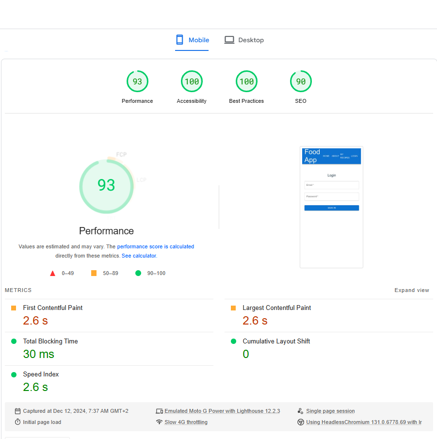
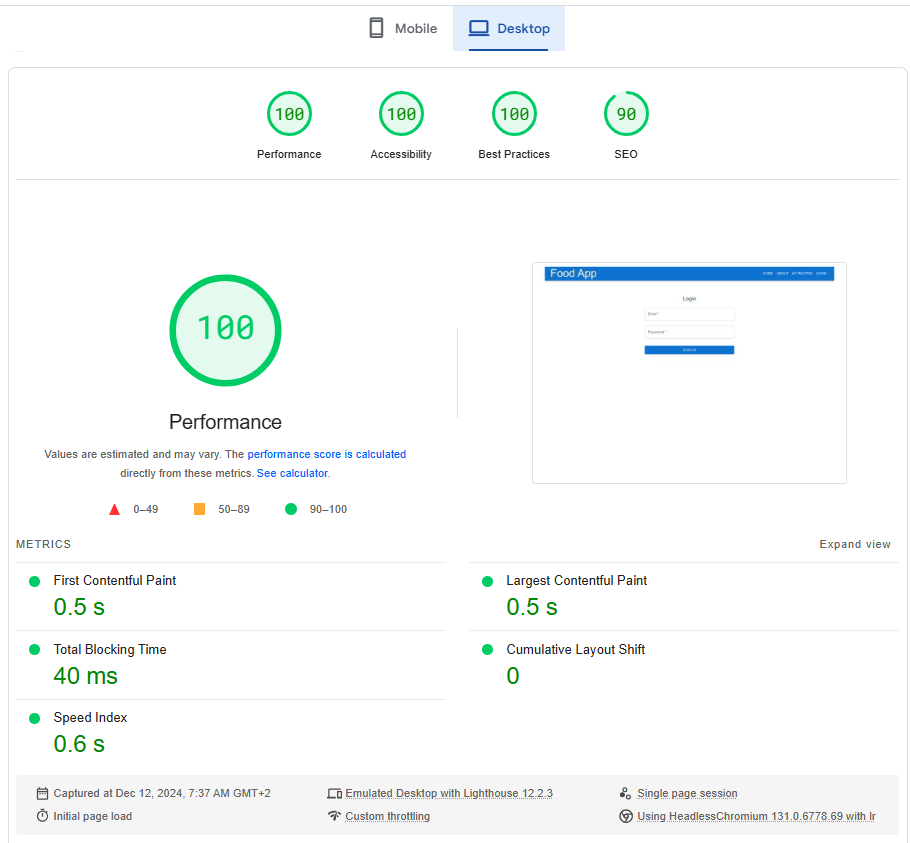

# Harjoitustehtävä
Harjoitustehtävänä loin yksinkertaisen reseptisovelluksen, joka on rakennettu käyttäen Viteä, Reactia, TypeScriptiä, Material-UI:ta, Mealdb:tä ja Firebasea.
## Responsiivisuus
### Toimivuus eri kokoisilla päätelaitteilla:

### Desktop
Sivusto toimii kehittäjän oletusten mukaisesti, kaikki elementit latautuvat ja asettuvat oikein. Käyttäjäkokemus on suunnitelmani mukainen ja looginen.

### Tablet
Layout mukautuu hyvin vaakasuunnassa ja mahdollisesti myöspystysuunnas kunhan tabletin resoluutio on molemmissa suunnissa vähintään 800 pikseliä, tällöin MUI x datagridin toiminnallisuudet ovat käytettävissä tarkoituksen mukaisesti.

### Mobiili
Sivusto ei ole valitettavasti täysin responsiivinen, koska käytin projektissa MUI x datagridia reseptien listaamiseen, joka ei valitettavasti ole täysin responsiivinen, koska se piilottaa näytön kavennettua sarakkeita.

## Toimivuus Uusimmilla Selaimilla
Sivusto on testattu seuraavilla selaimilla ja toimii kaikissa moitteettomasti:

Google Chrome (v131): Ei havaittuja ongelmia, kaikki elementit latautuvat oikein.
Mozilla Firefox (v133): Ei havaittuja ongelmia, kaikki elementit latautuvat oikein.
Microsoft Edge (v131): Ei havaittuja ongelmia, kaikki elementit latautuvat oikein.

## Sivujen Latautumisaika
Sivuston latautumisajat ovat erinomaiset desktopissa, mutta tuntemattomasta syystä MUI:n kirjaston lataamisessa mobiili testissä kesti erityisen kauan. Latausaika testit suoritettiin aluksi loginpagella, jonka jälkeen tarkkailin latausaikoja kirjautumisen takana olleilla sivuilla. testeistä ilmeni, että firestore tietokannan latausaika oli noin 1000ms, joka vaikuttaa mielestäni käyttäjäkokemukseen.

### Mobiili

#### Mobiili tulokset:
- First Contentful Paint: 2.6 s
- Largest Contentful Paint: 2.6 s
- Total Blocking Time: 30 ms
- Cumulative Layout Shift: 0
- Speed Index: 2.6 s

### Desktop

#### Desktop tulokset:
- First Contentful Paint: 0.5 s
- Largest Contentful Paint: 0.5 s
- Total Blocking Time: 40 ms
- Cumulative Layout Shift: 0
- Speed Index: 0.6 s

### [Linkki sivulle](https://kostikangasmaa.github.io/foodApp).
### [Linkki projektin repositorioon](https://github.com/kostikangasmaa/foodApp)
